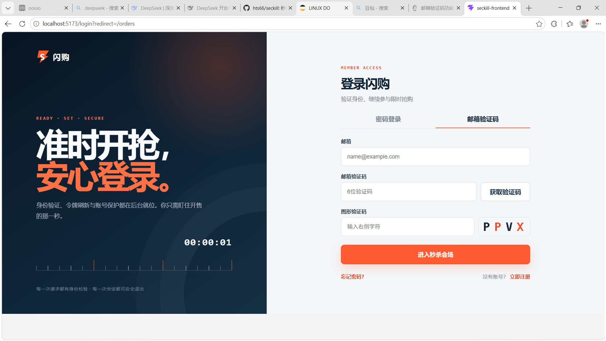
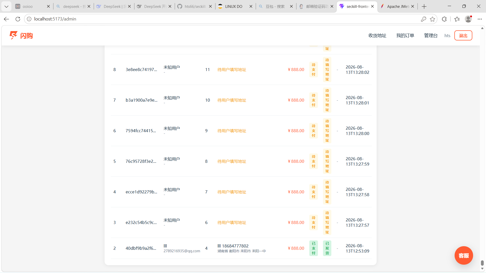
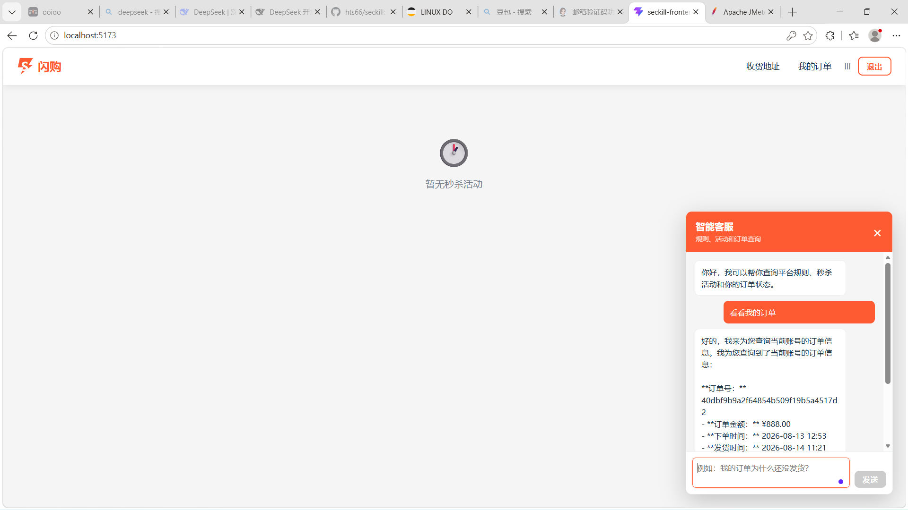
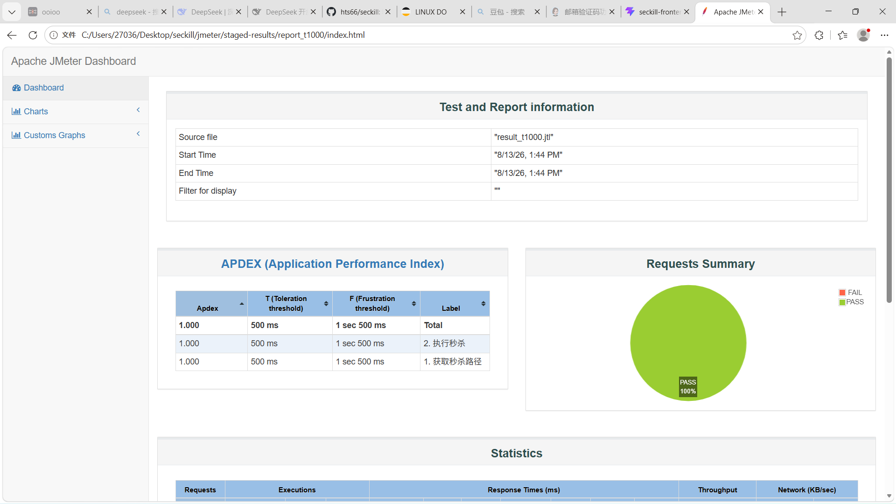

# 秒杀商城系统

基于 Spring Boot、Spring Cloud、Vue 3 和 Redis 的高并发秒杀商城，包含单体版与微服务版。系统支持商品管理、秒杀活动、异步下单、订单管理、收货地址、MinIO 图片上传和 AI 智能客服。

## 项目亮点

- Redis Lua 完成秒杀库存扣减和并发控制
- RabbitMQ 异步创建订单，支持超时取消与库存补偿
- JWT 登录认证、刷新令牌、动态秒杀路径和接口限流
- 管理员后台管理商品、活动、库存和订单
- AI 客服只读查询 FAQ、活动、商品和当前用户订单
- 数据库密码、令牌和第三方密钥统一通过 `.env` 注入

## 项目截图

### 登录与邮箱验证码



### 管理台订单



### AI 智能客服



### JMeter 压测报告



## 技术栈

| 层次 | 技术 |
| --- | --- |
| 后端 | Java 17、Spring Boot 3.2、Spring Security、MyBatis-Plus |
| 微服务 | Spring Cloud Gateway、Nacos、Spring Cloud Alibaba |
| 数据 | MySQL 8、Redis 7、RabbitMQ 3、MinIO |
| 前端 | Vue 3、Vite、Vue Router、Pinia、Axios |
| AI | Python、FastAPI、LangChain、LangGraph、DeepSeek API |
| 部署 | Docker Compose、Nginx |

## 架构

```text
Vue 3 前端 -> Gateway :8080 -> Auth :8101
                           -> Product :8102 -> MinIO
                           -> Activity :8103 -> Redis
                           -> Order :8104 -> RabbitMQ -> MySQL
                           -> AI Service :8200
                  Nacos :8848 提供注册与配置
```

## 目录结构

```text
src/                         Spring Boot 单体版
seckill-frontend/            Vue 3 前端
seckill-cloud/               Spring Cloud 微服务版
  seckill-gateway/           网关和 JWT 校验
  seckill-auth-service/      登录、注册和令牌
  seckill-product-service/   商品和 MinIO 图片
  seckill-activity-service/  活动和秒杀库存
  seckill-order-service/     订单和 MQ 消费
  ai-service/                FastAPI AI 客服
  sql/                       微服务数据库脚本
sql/                         单体数据库脚本
```

## 环境要求

JDK 17、Maven 3.9+、Node.js 18+、Docker Desktop、Docker Compose v2。Windows 推荐使用 PowerShell。

## 微服务版启动

```powershell
cd C:\Users\27036\Desktop\seckill\seckill-cloud
Copy-Item .env.example .env
notepad .env
.\scripts\generate-keys.ps1
.\scripts\docker-up.ps1 -Build
```

`.env` 至少填写数据库、RabbitMQ、MinIO、`INTERNAL_TOKEN` 和 `DEEPSEEK_API_KEY`，文件已被 Git 忽略。Docker Hub 访问较慢时：

```powershell
.\scripts\docker-up.ps1 -Build -DockerRegistry docker.1ms.run
```

只在 Docker 中运行基础设施、Java 服务在本机运行：

```powershell
docker compose up -d mysql redis rabbitmq minio nacos
mvn -DskipTests package
.\scripts\start-services.ps1
```

停止容器但保留数据卷：`.\scripts\docker-down.ps1`。停止本机 Java 服务：`.\scripts\stop-services.ps1`。

## 前端启动

```powershell
cd C:\Users\27036\Desktop\seckill\seckill-frontend
npm install
npm run dev
```

前端默认访问微服务网关 `http://localhost:8080`。切换到单体后端：

```powershell
$env:VITE_API_TARGET = 'http://localhost:8081'
npm run dev
```

构建：`npm run build`；预览：`npm run preview`。

## 单体版启动

根目录 `.env.example` 复制为 `.env` 后，单体配置会自动读取该文件：

```powershell
cd C:\Users\27036\Desktop\seckill
Copy-Item .env.example .env
notepad .env
mvn spring-boot:run
```

单体版端口为 `8081`，数据库脚本在 `sql/`。

## 常用地址

| 服务 | 地址 |
| --- | --- |
| Gateway | <http://localhost:8080> |
| Gateway 健康检查 | <http://localhost:8080/actuator/health> |
| AI 健康检查 | <http://localhost:8200/health> |
| Nacos | <http://localhost:8848/nacos> |
| RabbitMQ 管理台 | <http://localhost:15673> |
| MinIO 控制台 | <http://localhost:9011> |
| 单体后端 | <http://localhost:8081> |

## 数据库与 AI

微服务版第一次创建 `mysql-data` 数据卷时会自动执行 `seckill-cloud/sql/`。已有数据卷不会重复初始化，迁移时请手动执行 SQL。`docker compose down -v` 会删除全部数据卷，只应在确认需要重置时使用。

AI 客服位于 `seckill-cloud/ai-service`，需要在 `.env` 填写 `DEEPSEEK_API_KEY`。它只提供规则、活动、商品和当前用户订单查询，不提供支付、退款、改地址或发货写操作。详见 [`seckill-cloud/AI_CUSTOMER_SERVICE.md`](seckill-cloud/AI_CUSTOMER_SERVICE.md)。

## 排障与验证

```powershell
cd C:\Users\27036\Desktop\seckill\seckill-cloud
docker compose ps
docker compose logs -f seckill-gateway
docker compose logs -f ai-service
docker compose --env-file .env config --quiet
```

Java 日志在 `seckill-cloud/logs/`。登录或 JWT 校验失败时，重新生成 `keys/private.pem` 和 `keys/public.pem` 后重启服务。

## 安全提交到 GitHub

```powershell
cd C:\Users\27036\Desktop\seckill
git init
git add .
git status --short --ignored
git check-ignore -v .env seckill-cloud/.env
git commit -m "chore: initial seckill project"
git branch -M main
git remote add origin https://github.com/<你的用户名>/<仓库名>.git
git push -u origin main
```

不要提交真实 `.env`、RSA 私钥、日志、`target` 或测试令牌。原配置曾经出现过的密码和密钥应在公开仓库前全部轮换。
